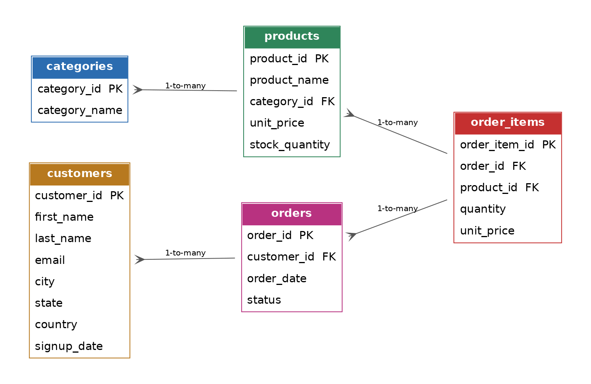
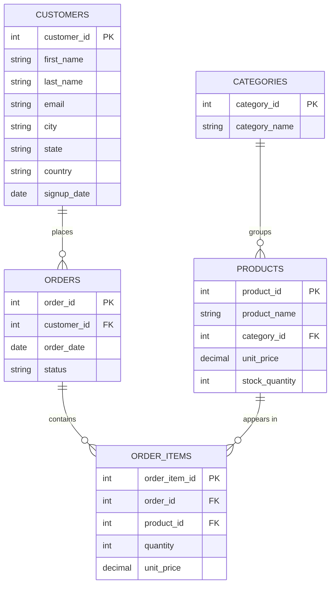

# E-Commerce Database Project

A relational SQLite database for a fictional e-commerce store, plus Python
scripts to generate realistic data, load it, and run organizing/analysis
queries on it. Built as a portfolio piece for data analyst work: designing
a schema, populating it with real-scale data, and turning raw rows into
answers.

## What's in here

```
ecommerce-db-project/
├── schema.sql              # Table definitions, constraints, indexes
├── scripts/
│   ├── generate_data.py    # Builds the database and seeds it with sample data
│   └── analyze.py          # Runs organizing/analysis queries against it
├── diagrams/
│   └── er_diagram.mermaid  # Entity-relationship diagram
├── data/
│   └── store.db            # The SQLite database (generated)
└── README.md
```

## Schema

Five tables: `categories`, `customers`, `products`, `orders`, and
`order_items`. Orders and order items are split so each order can hold
multiple products — a standard normalized design.



<details>
<summary>Mermaid source (renders on GitHub too)</summary>



</details>

## Setup

```bash
pip install faker
python3 scripts/generate_data.py   # builds data/store.db with sample data
python3 scripts/analyze.py         # runs the analysis queries
```

`generate_data.py` seeds 200 customers, 7 categories, 70 products, and
roughly 800 orders with 1-5 line items each — enough volume to make the
queries meaningful.

## Sample queries included

- Top 10 customers by total spend
- Revenue by category
- Monthly revenue trend
- Order status breakdown
- Low-stock products
- Average order value

These live in `scripts/analyze.py` and can be extended with new query
strings in the `QUERIES` dict.

## Results

Sample output from `scripts/analyze.py` run against the generated dataset
(200 customers, 800 orders, 2,456 order line items):

**Top 5 customers by total spend**

| Customer | Total Spent |
|---|---|
| Beth Daniels | $13,802.34 |
| Mark Brown | $13,711.83 |
| Barbara Parks | $11,130.15 |
| Donald Shah | $9,985.81 |
| Anita Baxter | $9,784.54 |

**Revenue by category**

| Category | Revenue |
|---|---|
| Home & Kitchen | $132,545.09 |
| Sports & Outdoors | $129,553.77 |
| Toys & Games | $127,030.89 |
| Clothing | $118,271.97 |
| Electronics | $112,755.07 |
| Beauty & Personal Care | $109,546.93 |
| Books | $100,309.11 |

**Order status breakdown**

| Status | Orders |
|---|---|
| Delivered | 511 |
| Shipped | 167 |
| Pending | 81 |
| Cancelled | 41 |

**Other findings**
- Average order value: **$1,093.56**
- Low-stock alert: 3 products under 20 units in stock (Poetry Collection: 3, Coffee Maker: 9, Comic: 10)
- Monthly revenue ranged from ~$10.8K to ~$59.5K over the 25-month window, with no single month dominating — a healthy, non-seasonal spread for this synthetic dataset

## Design notes

- Foreign keys and `CHECK` constraints enforce data integrity at the
  database level (no negative prices, no orders with an invalid status).
- Indexes are added on the columns used most often for joins/filters
  (`orders.customer_id`, `orders.order_date`, `order_items.order_id`,
  `order_items.product_id`, `products.category_id`).
- Data is randomized but seeded (`random.seed(42)`, `Faker.seed(42)`) so
  results are reproducible.

## Possible extensions

- Swap SQLite for Postgres/MySQL and add a `docker-compose.yml`
- Add a `reviews` table linked to `customers` and `products`
- Build a small dashboard (Streamlit or a Jupyter notebook) on top of
  `analyze.py`'s queries
- Add unit tests for the data generator
